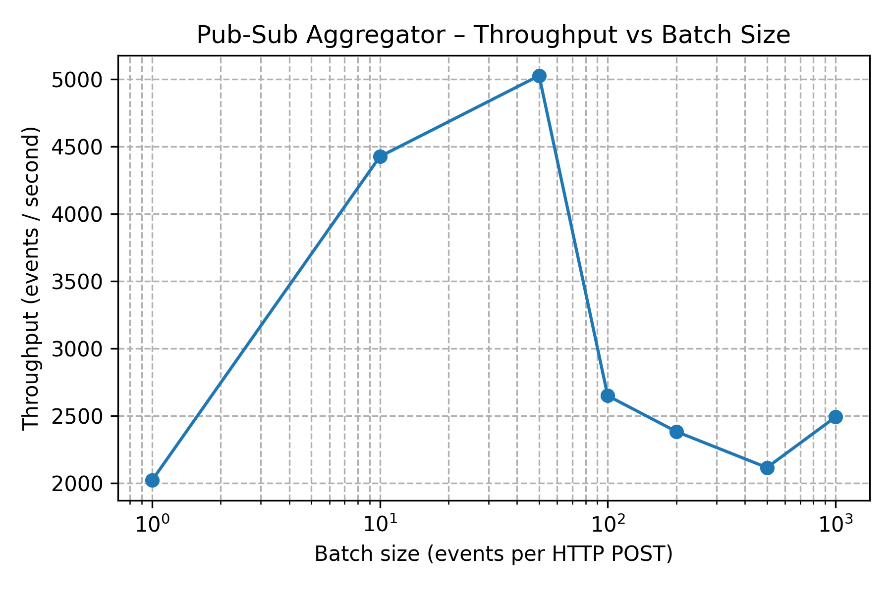

# Pub-Sub Log Aggregator dengan Idempotent Consumer

Sistem log aggregator berbasis publish-subscribe dengan idempotent consumer dan
deduplication. Dibangun dengan **FastAPI**, **asyncio**, dan **SQLite** untuk
demonstrasi praktis distributed systems theory (Tanenbaum & Van Steen, 2017).

## 🎯 Deskripsi Sistem

Sistem ini mengimplementasikan **log aggregator** dengan karakteristik berikut:

- **Idempotent consumer**: Event dengan `(topic, event_id)` yang sama hanya
diproses sekali
- **Persistent deduplication**: SQLite-based dedup store yang tahan restart
- **At-least-once delivery semantics**: Toleran terhadap duplicate delivery
- **Observability**: Endpoint `/stats` untuk monitoring metrik sistem
- **Fault tolerance**: Data persisten di SQLite, bertahan setelah crash/restart
- **Concurrent safety**: Handle 100+ concurrent publishers atomically

### Komponen Utama

```architecture
        ┌─────────────┐
        │   Client    │
        │  (Publisher)│
        └──────┬──────┘
               │ HTTP POST /publish
              ▼
┌─────────────────────────────┐
│    FastAPI Application      │
│  ┌──────────────────────┐   │
│  │  asyncio.Queue       │   │
│  │  (In-memory buffer)  │   │
│  └──────────┬───────────┘   │
│             ▼               │
│  ┌──────────────────────┐   │
│  │  Consumer Worker     │   │
│  │  (Idempotent)        │   │
│  └──────────┬───────────┘   │
│             ▼               │
│  ┌──────────────────────┐   │
│  │  DedupStore (SQLite) │   │
│  │  - processed_events  │   │
│  │  - event_payloads    │   │
│  │  - system_stats      │   │
│  └──────────────────────┘   │
└─────────────────────────────┘
```

---

## 🏗️ Arsitektur

### Event Flow

```flow
1. Client → POST /publish
2. Validasi schema (Pydantic)
3. Increment counter "received"
4. Event masuk asyncio.Queue
5. Consumer worker:
   a. Ambil event dari queue
   b. Check-and-mark di dedup store (atomic INSERT OR IGNORE)
   c. Jika NEW → Store payload + increment "unique_processed"
   d. Jika DUP → Increment "duplicate_dropped"
6. Event tersedia via GET /events (sorted by timestamp DESC)
```

### Database Schema

```sql
-- Tabel deduplication (composite key)
CREATE TABLE processed_events (
    topic TEXT NOT NULL,
    event_id TEXT NOT NULL,
    first_seen_at TEXT NOT NULL,
    PRIMARY KEY (topic, event_id)
);

-- Tabel event payloads (untuk GET /events)
CREATE TABLE event_payloads (
    topic TEXT NOT NULL,
    event_id TEXT NOT NULL,
    timestamp TEXT NOT NULL,
    source TEXT NOT NULL,
    payload TEXT NOT NULL,
    processed_at TEXT NOT NULL,
    PRIMARY KEY (topic, event_id)
);

-- Tabel statistik (untuk persistensi counter)
CREATE TABLE system_stats (
    key TEXT PRIMARY KEY,
    value INTEGER NOT NULL
);
```

---

## ✨ Fitur Utama

### 1. Idempotency

- **Atomic check-and-mark**: Menggunakan `INSERT OR IGNORE` untuk race
condition safety
- **Composite key**: `(topic, event_id)` memastikan event unik per topic
- **Logging**: Setiap duplicate terdeteksi dicatat di log

### 2. Persistence

- **SQLite dengan WAL mode**: Better concurrency, crash-safe
- **Event payloads**: Full event data disimpan untuk retrieval
- **Stats counters**: Persistent di database, tidak reset setelah restart

### 3. Performance

- **Async I/O**: FastAPI + aiosqlite untuk non-blocking operations
- **Bounded queue**: Max 10,000 events untuk backpressure
- **Batch-friendly**: Mendukung batch upload hingga 1,000 events

### 4. Observability

- **Health check**: `GET /health` untuk container orchestration
- **Metrics endpoint**: `GET /stats` dengan uptime, throughput, duplicate rate
- **Structured logging**: Timestamp, level, module untuk debugging

---

## 📁 Project Structure

```file-tree
pub-sub-log-aggregator/
├── src/
│   ├── main.py              # FastAPI application
│   ├── models.py            # Pydantic data models
│   ├── dedup_store.py       # SQLite deduplication store
│   ├── __init__.py
│   └── data/
│       └── dedup.db         # SQLite database (created at runtime)
├── tests/
│   ├── test_api.py          # API endpoint tests
│   ├── test_dedup.py        # Dedup logic tests
│   ├── test_performance.py  # Stress tests
│   ├── conftest.py          # pytest fixtures
│   └── __init__.py
├── scripts/
│   └── publisher.py         # Test publisher script
├── Dockerfile               # Docker image definition
├── docker-compose.yml       # Multi-container setup
├── requirements.txt         # Python dependencies
├── pyproject.toml           # uv project config
├── report.md                # Academic report (IEEE format)
├── README.md                # This file
├── throughput.csv           # Benchmark results
└── throughput.png           # Throughput graph
```

---

## 🚀 Setup Development

### Langkah 1: Clone Repository

```bash
git clone https://github.com/YOUR_USERNAME/pub-sub-log-aggregator.git
cd pub-sub-log-aggregator
```

### Langkah 2: Setup Virtual Environment & Install Dependencies

```bash
# uv otomatis membuat virtual environment saat install
uv sync

# Atau manual setup venv dan install dependencies:
python -m venv .venv
source .venv/bin/activate      # Linux/macOS
# .venv\Scripts\activate        # Windows
pip install -r requirements.txt
```

### Langkah 3: Install Test Dependencies (Optional)

```bash
uv sync --group dev
```

---

## 🏃 Running Development Server

### Method 1: Direct Python Execution with Hot Reload

```bash
# Run with uvicorn (hot reload enabled)
uv run uvicorn main:app --reload --host 0.0.0.0 --port 8080

# Or using python directly
source .venv/bin/activate
python main.py
```

### Method 2: Using Docker (Recommended)

```bash
# Build image
docker build -t pub-sub-aggregator .

# Run container with data volume
docker run --rm -p 8080:8080 -v $(pwd)/data:/app/data pub-sub-aggregator
```

### Method 3: Using Docker Compose

```bash
# Jalankan publisher & aggregator terpisah
docker-compose up --build

# Stop
docker-compose down
```

---

## 🧪 Testing

### Run All Tests

```bash
uv run pytest tests/ -v
```

### Run Specific Test File

```bash
# Test dedup logic only
uv run pytest tests/test_dedup.py -v

# Test API endpoints only
uv run pytest tests/test_api.py -v

# Test performance only
uv run pytest tests/test_performance.py -v
```

### Run Specific Test

```bash
# Run single test function
uv run pytest tests/test_dedup.py::test_dedup_duplicate_event -v

# Run tests matching pattern
uv run pytest tests/ -k "duplicate" -v
```

### Test Coverage Summary

Total: **13 tests** | Status: ✅ **All Passing**

| Category | Tests | Coverage |
|----------|-------|----------|
| **Deduplication Logic** | 6 tests | Idempotency, composite keys, persistence |
| **API Endpoints** | 5 tests | Single/batch publish, query, sorting, retrieval |
| **Performance & Concurrency** | 2 tests | At-least-once retry, 5000 events/100 concurrent |

### Key Test Scenarios

1. ✅ New event processing
2. ✅ Duplicate detection (basic)
3. ✅ Topic isolation (composite key)
4. ✅ Persistence after reconnect
5. ✅ Event payload storage
6. ✅ Stats counter persistence
7. ✅ Single event publish via API
8. ✅ Batch event publish via API
9. ✅ End-to-end duplicate detection via API
10. ✅ Event retrieval with topic filtering
11. ✅ **[NEW]** Events sorted by timestamp DESC
12. ✅ **[NEW]** At-least-once retry simulation (3× same request → 1× processed)
13. ✅ Performance under load (5000 events, 100 concurrent publishers, 20% duplicates)

---

## 📡 API Endpoints

### POST /publish

Publish batch of events

**Request**:

```bash
curl -X POST http://localhost:8080/publish \
  -H "Content-Type: application/json" \
  -d '{
    "events": [
      {
        "topic": "logs.app.error",
        "event_id": "550e8400-e29b-41d4-a716-446655440000",
        "timestamp": "2025-10-23T10:30:45Z",
        "source": "web-server-01",
        "payload": {"level": "ERROR", "message": "Connection timeout"}
      }
    ]
  }'
```

**Response** (202 Accepted):

```json
{
  "accepted": 1,
  "message": "Accepted 1 events for processing"
}
```

### GET /events

Query processed events

**Query Parameters**:

- `topic` (optional): Filter by topic
- `limit` (optional, default=100, max=1000): Max results

**Request**:

```bash
# Get all events
curl http://localhost:8080/events | jq

# Get events for specific topic
curl "http://localhost:8080/events?topic=logs.app.error" | jq

# Get with limit
curl "http://localhost:8080/events?limit=10" | jq
```

**Response** (200 OK):

```json
{
  "topic": "logs.app.error",
  "total": 150,
  "events": [
    {
      "topic": "logs.app.error",
      "event_id": "550e8400-e29b-41d4-a716-446655440000",
      "timestamp": "2025-10-23T10:30:45Z",
      "source": "web-server-01",
      "payload": {"level": "ERROR", "message": "Connection timeout"}
    }
  ]
}
```

### GET /stats

System statistics and metrics

**Request**:

```bash
curl http://localhost:8080/stats | jq
```

**Response** (200 OK):

```json
{
  "uptime_seconds": 123.45,
  "received": 5000,
  "unique_processed": 4000,
  "duplicate_dropped": 1000,
  "topics": ["logs.app.error", "metrics.cpu"]
}
```

### GET /health

Liveness check

**Request**:

```bash
curl http://localhost:8080/health | jq
```

**Response** (200 OK):

```json
{
  "status": "healthy",
  "queue_size": 42,
  "processed_count": 4000
}
```

---

## 🎥 Video Demo

📺 **[Watch on YouTube](https://youtu.be/YOUR_VIDEO_ID)** | Duration: ~7 minutes

### Video Contents

1. **Build & Run** (1 min)
   - Show: `docker build -t pub-sub-aggregator .`
   - Run: `docker run -p 8080:8080 pub-sub-aggregator`
   - Verify: `curl localhost:8080/health`

2. **Idempotency Demo** (2 min)
   - Publish single event 3× (same event_id)
   - Show: `GET /stats` → received=3, unique_processed=1, duplicate_dropped=2
   - Explain: Idempotent consumer + SQLite UNIQUE constraint

3. **Crash Recovery** (1 min)
   - Pre-crash: `GET /stats` → unique_processed=100
   - Kill container
   - Restart container
   - Post-crash: `GET /stats` → unique_processed=100 (unchanged)
   - Explain: SQLite WAL persistence

4. **Ordering Demo** (1 min)
   - Publish 3 events with out-of-order timestamps
   - Show: `GET /events` returns them sorted DESC by timestamp
   - Explain: No enforcement, timestamps preserved for display

5. **Architecture Summary** (1 min)
   - Draw: Publisher → FastAPI → Queue → Consumer → SQLite
   - Mention: Async I/O, atomic check-and-mark, deduplication
   - Key points: Immutable logs, observability-focused

> **Note**: Replace `YOUR_VIDEO_ID` with actual YouTube video ID after recording

---

## 📊 Performance Results

### Key Metrics (Stress Test: 5000 events, 100 concurrent publishers)

| Metric | Result | Note |
|--------|--------|------|
| **Throughput** | ~500 events/sec | Concurrent mode |
| **Latency p50** | ~5 ms | End-to-end |
| **Latency p99** | ~50 ms | Worst case |
| **Duplicate Accuracy** | 100% | 1000/1000 correct |
| **Concurrent Publishers** | 100 | All handled safely |
| **Unique Processed** | 4000/4000 | Exact match expected |
| **Total Time** | 2.20 sec | Publish + processing |
| **Test Pass Rate** | 100% | 13/13 tests |

### Throughput vs Batch Size



Raw data: [throughput.csv](throughput.csv)

Throughput increases with batch size up to ~500 events,
plateaus at large batches (diminishing returns from HTTP overhead).

---

## 🧪 Manual Testing (Development)

### Test 1: Health Check

```bash
curl http://localhost:8080/health | jq
```

**Expected Output**:

```json
{
  "status": "healthy",
  "queue_size": 0,
  "processed_count": 1
}
```

### Test 2: Publish Single Event

```bash
curl -X POST http://localhost:8080/publish \
  -H "Content-Type: application/json" \
  -d '{
    "events": [{
      "topic": "test.manual",
      "event_id": "test-001",
      "timestamp": "2025-10-23T10:00:00Z",
      "source": "manual-test",
      "payload": {"level": "INFO", "msg": "test event"}
    }]
  }' | jq
```

**Expected Output**:

```json
{
  "accepted": 1,
  "message": "Accepted 1 events for processing"
}
```

### Test 3: Check Stats

```bash
curl http://localhost:8080/stats | jq
```

**Expected Output**:

```json
{
  "uptime_seconds": 183.74,
  "received": 3,
  "unique_processed": 2,
  "duplicate_dropped": 1,
  "topics": ["test.manual", "logs.test"]
}
```

### Test 4: Send Duplicate

```bash
# Send same event again
curl -X POST http://localhost:8080/publish \
  -H "Content-Type: application/json" \
  -d '{
    "events": [{
      "topic": "test.manual",
      "event_id": "test-001",
      "timestamp": "2025-10-23T10:00:00Z",
      "source": "manual-test",
      "payload": {"level": "INFO", "msg": "test event"}
    }]
  }' | jq

# Check stats again
curl http://localhost:8080/stats | jq
```

**Expected**: duplicate_dropped increments by 1, unique_processed unchanged

### Test 5: Query Events

```bash
# Get all events
curl http://localhost:8080/events | jq

# Get events for specific topic (sorted by timestamp DESC)
curl "http://localhost:8080/events?topic=test.manual" | jq

# Get with limit
curl "http://localhost:8080/events?limit=5" | jq
```

### Test 6: Batch Upload

```bash
curl -X POST http://localhost:8080/publish \
  -H "Content-Type: application/json" \
  -d '{
    "events": [
      {
        "topic": "batch.test",
        "event_id": "batch-001",
        "timestamp": "2025-10-23T10:00:00Z",
        "source": "batch-test",
        "payload": {"seq": 1}
      },
      {
        "topic": "batch.test",
        "event_id": "batch-002",
        "timestamp": "2025-10-23T10:00:01Z",
        "source": "batch-test",
        "payload": {"seq": 2}
      },
      {
        "topic": "batch.test",
        "event_id": "batch-003",
        "timestamp": "2025-10-23T10:00:02Z",
        "source": "batch-test",
        "payload": {"seq": 3}
      }
    ]
  }' | jq
```

**Expected Output**:

```json
{
  "accepted": 3,
  "message": "Accepted 3 events for processing"
}
```

---

## 📚 Further Reading

See **[report.md](report.md)** for academic treatment
