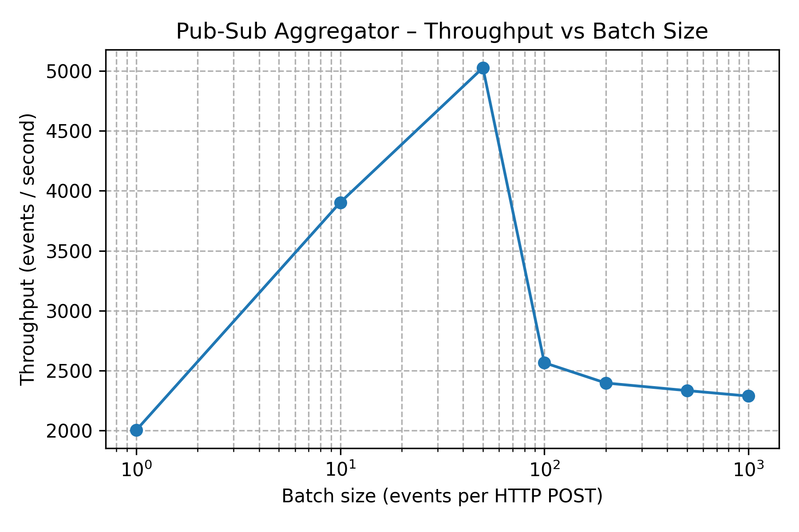

# Pub-Sub Log Aggregator dengan Idempotent Consumer

Sistem log aggregator berbasis publish-subscribe dengan idempotent consumer dan
deduplication.

## 🎯 Deskripsi Sistem

Sistem ini mengimplementasikan **log aggregator** dengan karakteristik berikut:

- **Idempotent consumer**: Event dengan `(topic, event_id)` yang sama hanya
diproses sekali
- **Persistent deduplication**: SQLite-based dedup store yang tahan restart
- **At-least-once delivery semantics**: Toleran terhadap duplicate delivery
- **Observability**: Endpoint `/stats` untuk monitoring metrik sistem
- **Fault tolerance**: Data persisten di SQLite, bertahan setelah crash/restart

### Komponen Utama

```diagram
        ┌─────────────┐
        │   Client    │
        │  (Publisher)│
        └──────┬──────┘
               │ HTTP POST /publish
              ▼
┌─────────────────────────────┐
│    FastAPI Application      │
│  ┌──────────────────────┐   │
│  │  asyncio.Queue       │   │
│  │  (In-memory buffer)  │   │
│  └──────────┬───────────┘   │
│             ▼               │
│  ┌──────────────────────┐   │
│  │  Consumer Worker     │   │
│  │  (Idempotent)        │   │
│  └──────────┬───────────┘   │
│             ▼               │
│  ┌──────────────────────┐   │
│  │  DedupStore (SQLite) │   │
│  │  - processed_events  │   │
│  │  - event_payloads    │   │
│  │  - system_stats      │   │
│  └──────────────────────┘   │
└─────────────────────────────┘
```

## 🏗️ Arsitektur

### Event Flow

```Flow
1. Client → POST /publish
2. Validasi schema (Pydantic)
3. Increment counter "received"
4. Event masuk asyncio.Queue
5. Consumer worker:
   a. Ambil event dari queue
   b. Check-and-mark di dedup store (atomic)
   c. Jika NEW → Store payload + increment "unique_processed"
   d. Jika DUP → Increment "duplicate_dropped"
6. Event tersedia via GET /events
```

### Database Schema

```sql
-- Tabel deduplication
CREATE TABLE processed_events (
    topic TEXT NOT NULL,
    event_id TEXT NOT NULL,
    first_seen_at TEXT NOT NULL,
    PRIMARY KEY (topic, event_id)
);

-- Tabel event payloads (untuk GET /events)
CREATE TABLE event_payloads (
    topic TEXT NOT NULL,
    event_id TEXT NOT NULL,
    timestamp TEXT NOT NULL,
    source TEXT NOT NULL,
    payload TEXT NOT NULL,
    processed_at TEXT NOT NULL,
    PRIMARY KEY (topic, event_id)
);

-- Tabel statistik (untuk persistensi counter)
CREATE TABLE system_stats (
    key TEXT PRIMARY KEY,
    value INTEGER NOT NULL
);
```

---

## ✨ Fitur Utama

### 1. Idempotency

- **Atomic check-and-mark**: Menggunakan `INSERT OR IGNORE` untuk race
condition safety
- **Composite key**: `(topic, event_id)` memastikan event unik per topic
- **Logging**: Setiap duplicate terdeteksi dicatat di log

### 2. Persistence

- **SQLite dengan WAL mode**: Better concurrency, crash-safe
- **Event payloads**: Full event data disimpan untuk retrieval
- **Stats counters**: Persistent di database, tidak reset setelah restart

### 3. Performance

- **Async I/O**: FastAPI + aiosqlite untuk non-blocking operations
- **Bounded queue**: Max 10,000 events untuk backpressure
- **Batch-friendly**: Mendukung batch upload hingga 1,000 events

### 4. Observability

- **Health check**: `GET /health` untuk container orchestration
- **Metrics endpoint**: `GET /stats` dengan uptime, throughput, duplicate rate
- **Structured logging**: Timestamp, level, module untuk debugging

## 🚀 Setup Development

### Langkah 1: Clone Repository

```bash
# Clone repository
git clone https://github.com/YOUR_USERNAME/pub-sub-log-aggregator.git
cd pub-sub-log-aggregator
```

### Langkah 2: Setup Virtual Environment & Install  Dependencies

```bash
# uv otomatis membuat virtual environment saat install
uv sync

# Atau manual setup venv dan install dependencies:
python -m venv .venv
source .venv/bin/activate  # Linux/macOS
# .venv\Scripts\activate   # Windows
pip install -r requirements.txt
```

#### install test dependencies for uv (Optional)

```bash
# Install test dependencies
uv sync --group dev
```

---

## 🏃 Running Development Server

### Method 1: Direct Python Execution

```bash
# Run with uvicorn (hot reload enabled)
uv run uvicorn main:app --reload --host 0.0.0.0 --port 8080

# Or using python directly
# Activate virtual environment first
source .venv/bin/activate

# Run application
python main.py
```

---

## 🐳 Cara Run di Docker

```bash
# Build image
docker build -t pub-sub-aggregator .

# Run container
docker run --rm -p 8080:8080 -v $(pwd)/data:/app/data pub-sub-aggregator
```

---

## 🐙 Docker Compose

```bash
# Jalankan publisher & aggregator terpisah
docker-compose up --build
```

---

## 🧪 Testing (pytest)

### Langkah 1: Run all tests

```bash
# Run all tests with uv
uv run pytest tests/ -v
```

### Langkah 2: Run Specific Test File

```bash
# Test dedup logic only
uv run pytest tests/test_dedup.py -v

# Test API endpoints only
uv run pytest tests/test_api.py -v

# Test performance only
uv run pytest tests/test_performance.py -v
```

### Langkah 3: Run Specific Test

```bash
# Run single test function
uv run pytest tests/test_dedup.py::test_dedup_duplicate_event -v

# Run tests matching pattern
uv run pytest tests/ -k "duplicate" -v

# Run tests with markers (if defined)
uv run pytest tests/ -m "slow" -v
```

### Test Coverage Summary

Total: **11 tests** covering:

| Category | Tests | Coverage |
|----------|-------|----------|
| **Deduplication Logic** | 6 tests | Core idempotency, composite keys, |
|                         |         | persistence                       |
| **API Endpoints** | 4 tests | POST /publish, GET /events, GET /stats |
| **Performance** | 1 test | 5000 events with 20% duplicates |

**Key Test Scenarios:**

1. ✅ New event processing
2. ✅ Duplicate detection
3. ✅ Topic isolation (composite key)
4. ✅ Persistence after reconnect
5. ✅ Event payload storage
6. ✅ Stats counter persistence
7. ✅ Single event publish
8. ✅ Batch event publish
9. ✅ End-to-end duplicate detection
10. ✅ Event retrieval with filtering
11. ✅ Performance under load (5000+ events)

---

## 🧪 Manual Testing (Development)

### Test 1: Health Check

Using httpie

```bash
http :8080/health

# HTTP/1.1 200 OK
# content-length: 55
# content-type: application/json
# date: Thu, 23 Oct 2025 03:33:42 GMT
# server: uvicorn
# 
# {
#     "processed_count": 1,
#     "queue_size": 0,
#     "status": "healthy"
# }
```

### Test 2: Publish Single Event

```bash
http POST :8080/publish events:='[{
                    "topic": "logs.test",
                    "event_id": "550e8400-e29b-41d4-a716-446655440000asdasd",
                    "timestamp": "2025-10-22T21:35:00Z",
                    "source": "httpie",
                    "payload": {"level": "INFO", "msg": "hello from httpie"}
                }]'

# HTTP/1.1 202 Accepted
# content-length: 59
# content-type: application/json
# date: Thu, 23 Oct 2025 03:35:29 GMT
# server: uvicorn
# 
# {
#     "accepted": 1,
#     "message": "Accepted 1 events for processing"
# }
```

### Test 3: Check Stats

```bash
fzhnf@fedora ~> http :8080/stats

# HTTP/1.1 200 OK
# content-length: 118
# content-type: application/json
# date: Thu, 23 Oct 2025 03:36:41 GMT
# server: uvicorn
# 
# {
#     "duplicate_dropped": 1,
#     "received": 3,
#     "topics": [
#         "docker.test",
#         "logs.test"
#     ],
#     "unique_processed": 2,
#     "uptime_seconds": 183.74
# }
```

### Test 4: Send Duplicate

```bash
http POST :8080/publish events:='[{
                    "topic": "logs.test",
                    "event_id": "550e8400-e29b-41d4-a716-446655440000asdasd",
                    "timestamp": "2025-10-22T21:35:00Z",
                    "source": "httpie",
                    "payload": {"level": "INFO", "msg": "hello from httpie"}
                }]'
# HTTP/1.1 202 Accepted
# content-length: 59
# content-type: application/json
# date: Thu, 23 Oct 2025 03:37:56 GMT
# server: uvicorn
# 
# {
#     "accepted": 1,
#     "message": "Accepted 1 events for processing"
# }


http :8080/stats
# HTTP/1.1 200 OK
# content-length: 118
# content-type: application/json
# date: Thu, 23 Oct 2025 03:38:04 GMT
# server: uvicorn
# 
# {
#     "duplicate_dropped": 2,
#     "received": 4,
#     "topics": [
#         "logs.test"
#     ],
#     "unique_processed": 2,
#     "uptime_seconds": 265.79
# }
```

### Test 5: Query Events

```bash
# Get all events
curl http://localhost:8080/events | jq

# Get events for specific topic
curl "http://localhost:8080/events?topic=test.manual" | jq

# Get with limit
curl "http://localhost:8080/events?limit=10" | jq
```

### Test 6: Batch Upload

```bash
http POST :8080/publish events:='[
  {
    "topic": "batch.test",
    "event_id": "batch-001",
    "timestamp": "2025-10-23T10:00:00Z",
    "source": "batch-test",
    "payload": {"seq": 1}
  },
  {
    "topic": "batch.test",
    "event_id": "batch-002",
    "timestamp": "2025-10-23T10:00:01Z",
    "source": "batch-test",
    "payload": {"seq": 2}
  },
  {
    "topic": "batch.test",
    "event_id": "batch-003",
    "timestamp": "2025-10-23T10:00:02Z",
    "source": "batch-test",
    "payload": {"seq": 3}
  }
]'

# HTTP/1.1 202 Accepted
# content-length: 59
# content-type: application/json
# date: Thu, 23 Oct 2025 03:41:20 GMT
# server: uvicorn
# 
# {
#     "accepted": 3,
#     "message": "Accepted 3 events for processing"
# }
```

## 🎥 Video Demo (YouTube)

- Link demo: <https://youtu.be/XXXXXXXXXXX>

> [!NOTE]
>Isi video:
>
> - Build & run container
> - Kirim duplikat → idempotency terbukti
> - Restart container → data tetap
> - Penjelasan arsitektur 30 detik

## Throughput vs Batch Size



Raw data: [throughput.csv](throughput.csv)
